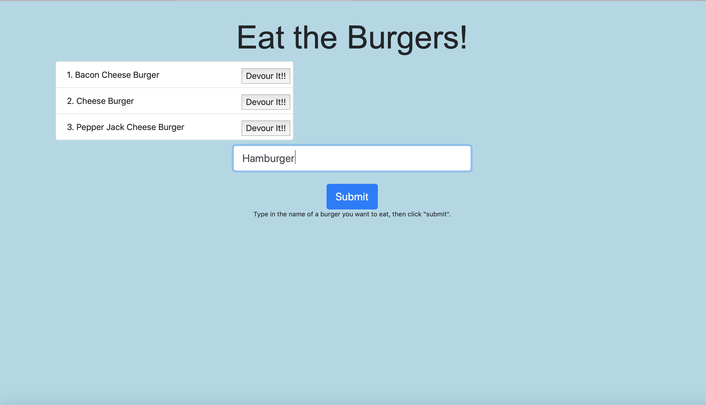
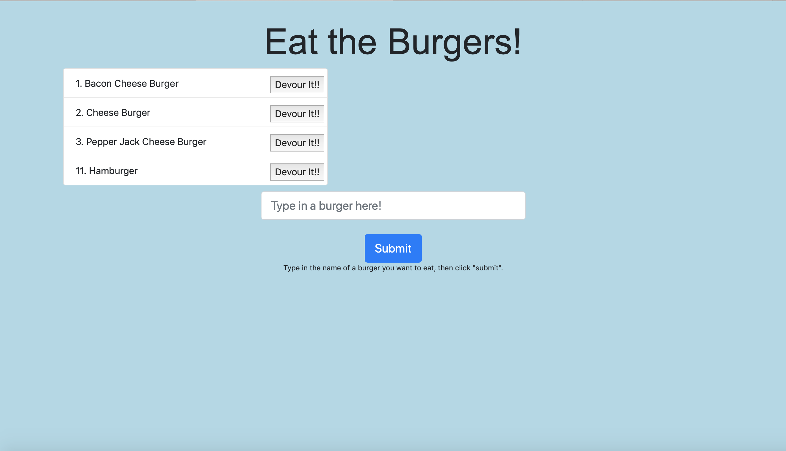
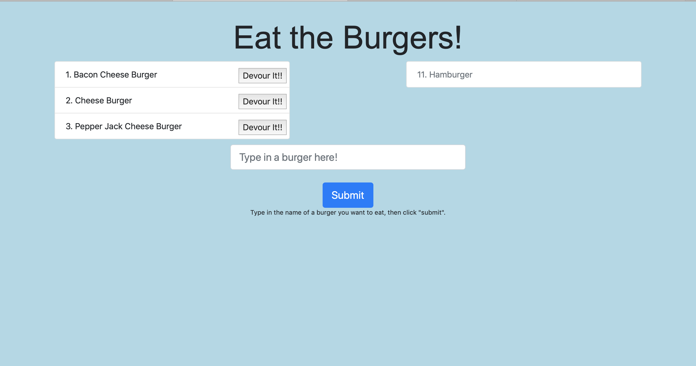

# Eat the Burger App

# Creator: Drew Pepin
# Created on: October 4th 2019

## About the App 
The eat the burger app allows the user to create and "devour" burgers, using a database that keeps track of the burgers and updates them as you create/devour. 

## How to use
Go to https://eat-the-burger95.herokuapp.com and create/devour!

## Create
Type in the name of the burger you wish to create, and it will appear in the list of burgers. 

## Devour
Click on the "devour" button to delete any burger you want.

## Technologies used
- javascript
- Nodejs
- Node packages
 - body-parser
 - express
 - mysql
- Handlebars
- GIT
- Github
- HTML
- CSS
- clearDB
